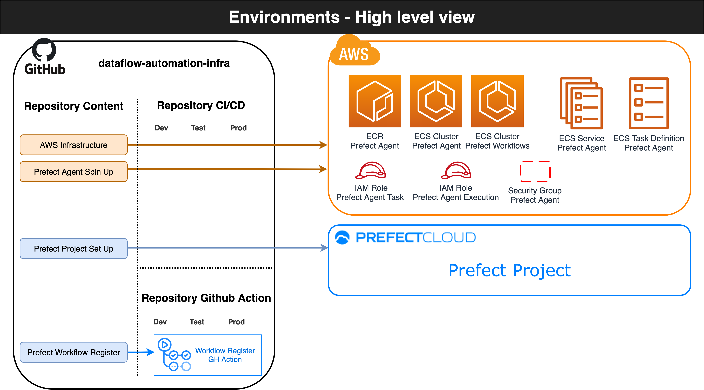
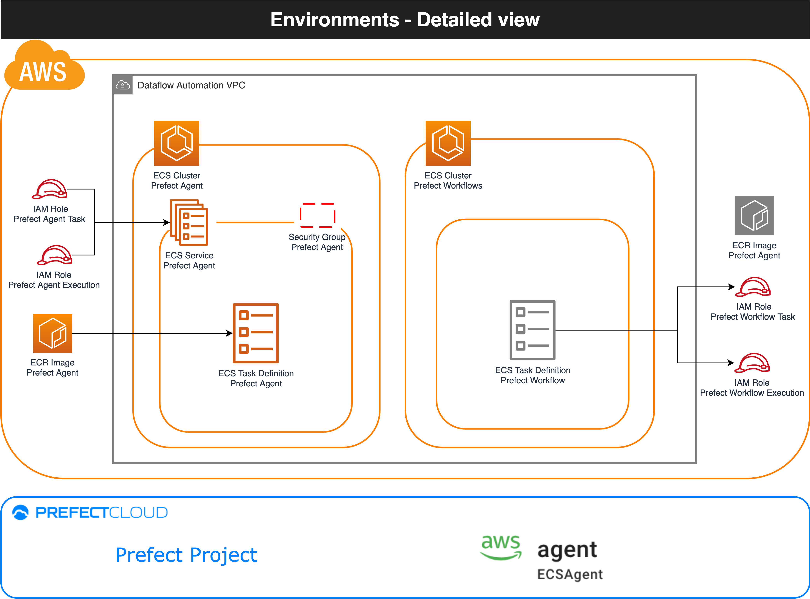
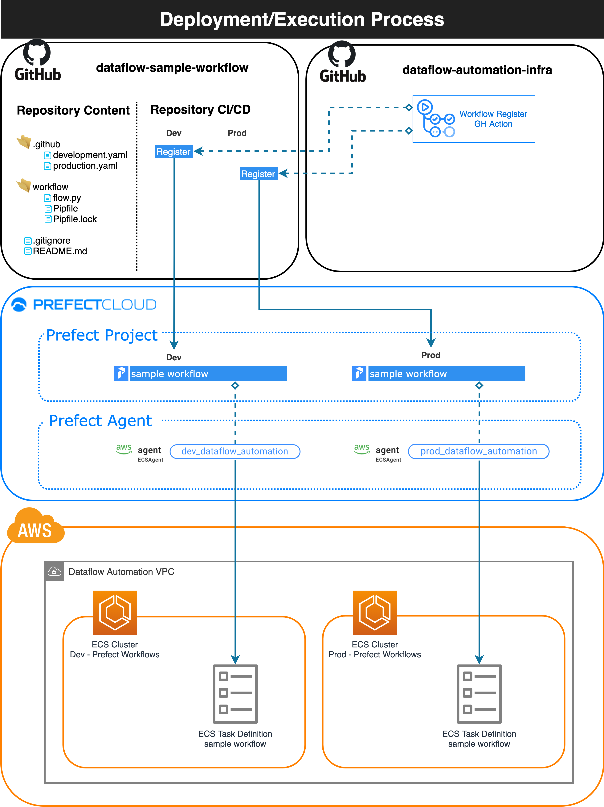

# dataflow-automation-infra 

> **_NOTE:_**  This README file is still WIP 

 

## Table of Contents  
[Summary](#summary)  
[Architecture](#architecture)  
[Deployment](#deployment)  
<a name="summary"/>
 

## Summary

[Prefect](https://www.prefect.io/) is an open-source worflow management system that comes with many features that facilitates building, maintaining and troubleshooting data pipelines. Its [cloud solution](https://www.prefect.io/cloud/) puts a management layer on top of their framework that enables teams to schedule and troubleshoot workflows while operating under a [hibryd model](https://medium.com/the-prefect-blog/the-prefect-hybrid-model-1b70c7fd296) that guarantees that the execution layer remains on the customer side.

By saying that, the responsibillity to *spin up* and *integrate* the execution layer with *Prefect Cloud* is all on the customer's plate, demanding a decent level of engineering effort. This project:

#### Automates the creation of execution environments on AWS
[Terraform](https://www.terraform.io/) is an open-source infrastructure as code tool used to spin up resources in the cloud. This project takes advantage of Terraform to spin up executions environments to run workflows.
 

#### Integrates execution environments with Prefect Cloud
[Prefect Agent](https://docs.prefect.io/orchestration/agents/overview.html) are long running processes used to communicate customer's *execution environments* with *Prefect Cloud*. This project builds a container image to run the Prefect Agent and creates the infrastructure around it that guaratees it is fault-tolerant and can successfully authenticate to Prefect Cloud.
 

#### Offers an interface to register workflows
[Github Actions](https://github.com/features/actions) is a Github feature that automates the execution of workflows in response to events. It is used to define steps that build, test, and deploy projects on any platform while Github manages the execution. 
 
What makes Github Actions more interesting is that besides playing the common *CI/CD* role it also offers a marketplace where developers can reference existing **Actions** to build their workflows and also publish their own actions for other developers/repositories to consume. 
 
This project publishes/maintains a **custom Github Action** responsible for deploying workflows to Prefect Cloud. This **action** is available thorugh the marketplace so other repositories can easily push their workflows to Prefect Cloud and run them inside AWS execution environments deployed by *dataflow-automation-infra*. Please [check this repository](https://github.com/maikelpenz/dataflow-sample-workflow) to see this custom action in use.

&nbsp;<a name="architecture"/>
## Architecture

This section goes into the architecture and implementation details of this project

#### High level view

 

**<h3>Detailed view</h3>**

 

**<h3>Deployment/Execution process</h3>**

 

&nbsp;<a name="deployment"/>
## Deployment
TODO