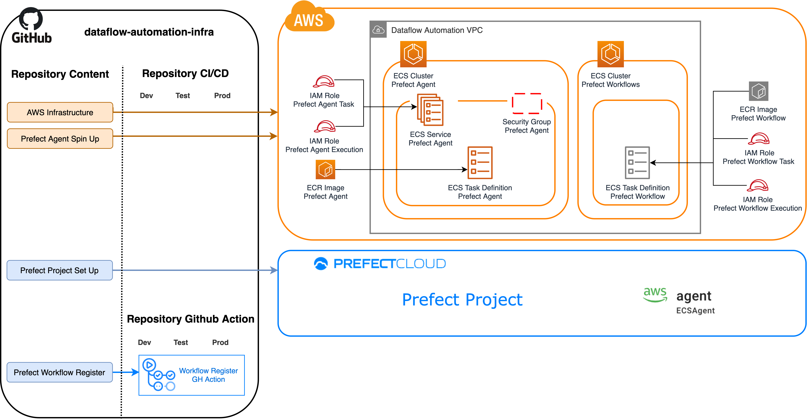
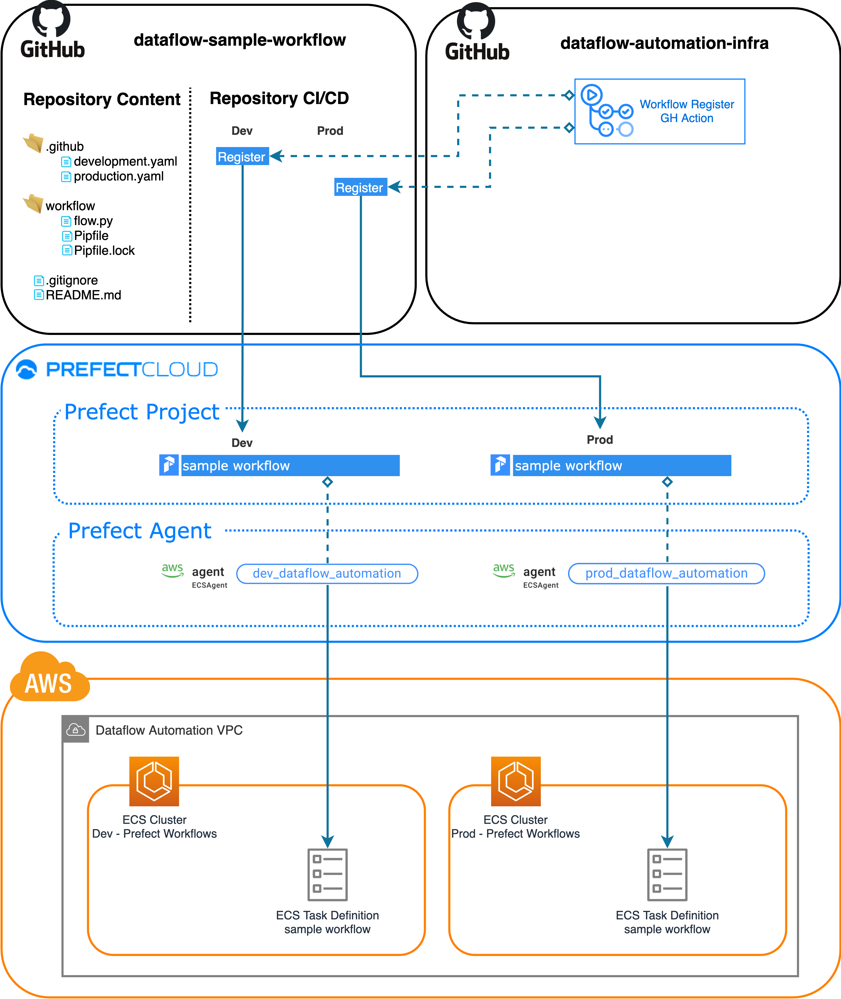
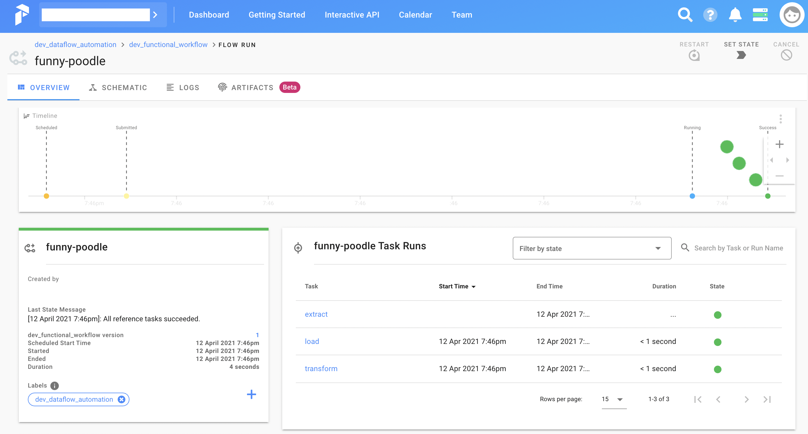

# dataflow-automation-infra 


## Table of Contents  
[Summary](#summary)  
[Architecture](#architecture)  
[Deployment](#deployment)  
<a name="summary"/>
<br>

## Summary

[Prefect](https://www.prefect.io/) is an open-source workflow management system that comes with many features that facilitates building, maintaining and troubleshooting data pipelines. Its [cloud solution](https://www.prefect.io/cloud/) puts a management layer on top of the framework that enables teams to schedule and troubleshoot workflows while operating under a [hybrid model](https://medium.com/the-prefect-blog/the-prefect-hybrid-model-1b70c7fd296) that guarantees that the execution layer remains on the customer side.

By saying that, the responsibility to *spin up* and *integrate* the execution layer with *Prefect Cloud* is on the customer's plate. This project works as a starting point for teams wanting to get up and running fast to experiment and deploy workflows with Prefect. Features:

### Automates the creation of execution environments on AWS
[Terraform](https://www.terraform.io/) is an open-source infrastructure as code tool used to spin up resources in the cloud. This project takes advantage of Terraform to spin up executions environments on AWS to run workflows.
<br>

### Integrates execution environments with Prefect Cloud
[Prefect Agents](https://docs.prefect.io/orchestration/agents/overview.html) are a long running processes used to communicate *execution environments* with *Prefect Cloud*. This project builds up a container image to run the Prefect Agent and creates the infrastructure around it that guarantees it is fault-tolerant and that it can successfully authenticate to Prefect Cloud to register Prefect Agents.
<br>

### Offers an interface to register workflows
[Github Actions](https://github.com/features/actions) is a Github feature that automates the execution of workflows in response to events. It is used to define steps that build, test, and deploy projects on any platform while Github manages the pipeline execution. 
<br>
<br>
What makes Github Actions more interesting is that besides configuring and running pipelines it also offers a [marketplace](https://github.com/marketplace) of custom *actions* where developers [publish their own actions](https://docs.github.com/en/actions/creating-actions) so other developers/repositories can consume them. 
<br>
<br>
This project maintains a custom Github Action responsible for **deploying workflows to Prefect Cloud**. Other repositories can then reference this action to easily register workflows to Prefect Cloud and run them inside AWS execution environments deployed by *dataflow-automation-infra*. Please [check this repository](https://github.com/maikelpenz/dataflow-sample-workflow) to see this custom action in use.

&nbsp;<a name="architecture"/>
## Architecture

Four components are automatically deployed through the CI/CD pipeline of this repository. All steps are run across three different AWS environments (dev, test and prod)

* AWS Infrastructure: permanent cloud resources required to execute workflows
* Prefect Agent Spin Up: this step builds the docker image where the Prefect Agent runs from and pushes it to AWS ECR
* Prefect Project Set Up: creates the prefect project on Prefect Cloud
* Prefect Workflow Register: Updates/maintains the Github Action responsible for registering workflows to Prefect Cloud

<br>



<br>

Besides deploying the components above, the CI/CD pipeline:

- Runs unit tests in *dev*
- Runs unit tests and functional tests in *test*

There are two functional tests that validate:

- Workflows can be pushed to Prefect Cloud using the *Workflow Register* Github Action
- The Prefect Agent successfully spins up on AWS ECS and it also appears *as active* on Prefect Cloud's agent list. 

<br>

### Github Action - Workflow Register

This github action automates the registration of workflows to Prefect Cloud. Through its inputs/parameters one can configure memory/cpu and also pick an execution environment to run the workflow on (execution environment deployed as part of this repo's infrastructure). 

The idea is that *dataflow-automation-infra* is only responsible for the infrastructure and workflows are placed in *one* or *many* external repositories. The following image illustrates how a workflow named `sample_workflow` is placed on a repository named `dataflow-sample-workflow` and uses the github action to register workflow versions for development and production environments. Once registered, the *prefect agent* listens to schedules/ad-hoc runs of this workflow and fires them to an AWS execution environment.

<br>



<br>

&nbsp;<a name="deployment"/>
## Deployment

Pre requisites:
* AWS Account
* Prefect Cloud Account
* Github Account

These are the steps to deploy the execution environment infrastructure to your own AWS account:
<br>

#### 1 - AWS: configure access keys and create deployment buckets

a) create access keys to be used by the Github CI/CD pipeline
The Github CI/CD pipeline must be able to communicate with your AWS Account to deploy resources. Here we create keys to grant the right access.

- Log into your AWS account
- Go to IAM > Users
- If you don't have a user created please click on `Add User`
- On the _Security credentials_ tab click on `Create access key`
- Copy both the _Access Key_ and the _Secret Access Key_ somewhere safe

b) create S3 buckets for terraform state and terraform artifacts. On AWS, go to S3 and create 2 buckets. 
Names must be globally unique. E.g:

`<account-number>-dataflow-automation-infra-artifacts` <br>
`<account-number>-dataflow-automation-infra-tf-state`


#### 2 - Prefect Cloud: create _Agent_ and _Workflow Register_ API tokens 
Both the Github CI/CD pipeline and AWS must be able to connect to Prefect Cloud to spin up the agent and also to register workflows.

- Log into Prefect Cloud and under the top menu select `team` and then `Service Accounts`
- Click on `Add Service Account` and put a name to your group of API keys. E.g: ApisGroup
- use the `Create API Key` button to create 2 API keys: _PrefectAgent_ and _WorkflowRegister_. Make sure you copy the keys.

#### 3 - Github: Fork and Clone forked *dataflow-automation-infra*

- Fork and Clone this repository following the instructions [from this link](https://docs.github.com/en/github/getting-started-with-github/fork-a-repo)

#### 4 - Github: Configure *YOUR_GITHUB_ACCOUNT/dataflow-automation-infra* secrets
On your forked version of *dataflow-automation-infra* we will now configure secret variables so the CI/CD pipeline can connect to AWS and Prefect Cloud.
Credentials configured in this step uses the keys configured on steps 1 and 2 above.

- Using a web browser go to your forked repository on Github. On the top menu, click on `Settings`
- One the left side menu click on `Secrets`
- Create the following 4 secrets (names are self explanatory):

AWS_ACCESS_KEY_ID: <from step 1 above> <br>
AWS_SECRET_ACCESS_KEY: <from step 1 above> <br>
PREFECT_AGENT_TOKEN: <from step 2 above> <br>
PREFECT_WORKFLOW_REGISTER_TOKEN: <from step 2 above>

The last thing to do is to enable Github Actions for this forked repository. By default it comes disabled to avoid running the actions from the main repository inadvertently.

- Using a web browser go to your forked repository on Github. On the top menu, click on `Actions`
- Click on the green button `I understand my workflows..` 

#### 5 - Command line tool: Create branch to trigger the deployment pipeline
With the repository forked and the credentials configured we now need to create a branch to push the infrastructure to _dev_, _test_ and _production_ environments.

The *dataflow-automation-infra* repository - *partially* - follows the [Gitflow branching pattern](https://www.atlassian.com/git/tutorials/comparing-workflows/gitflow-workflow):
*master* is the main branch
*develop* is an integration branch for new features
*feature branches* are created to introduce new features and first merged into *develop* before going to *master*   

- using your command-line tool of preference go to the cloned repository (from step 3) directory. 
- checkout *develop*: ```git checkout develop```
- create and push a *feature branch*: <br> 
    ```
        git checkout -b feature/deploy_infrastructure
        git push -u origin feature/deploy_infrastructure
    ```
- update terraform state and artifacts bucket names (from step 1b above).
    On each one of these 3 files:
    ```
        .github/workflows/development.yaml
        .github/workflows/integration.yaml
        .github/workflows/production.yaml
    ````
    Update the following two lines 
    ```
        tf_artifacts_bucket: `<account-number>-dataflow-automation-infra-artifacts`
        tf_state_bucket: `<account-number>-dataflow-automation-infra-tf-state`
    ```

- commit and push
    ```
        git add .
        git commit -m "deploying infra"
        git push
    ```

- Using a web browser go to your forked repository on Github. On the top menu, click on `Actions`. You should see the github action for development run successfully from end-to-end.

#### 6 - Prefect Cloud and AWS: testing the deployed infrastructure
As part of the _dev_ CI/CD pipeline, the last step registers a workflow named *dev_functional_workflow* to Prefect Cloud.

- Log into Prefect Cloud, find your workflow under the *dev_dataflow_automation* project. Trigger a `Quick run`
- Switch to AWS, enter AWS ECS, watch a pending task beeing created under the cluster *dev_dataflow_automation_workflows*
- The workflow should succeed. If that is the case, you just proved the dev environment is working :tada:



#### 7 - Deploying to test and production
When merging your *feature branch* to *develop*, the *test* pipeline will be triggered to validate everything is working.
When merging *develop* into *master*, the *production* pipeline will deploy the resources to production.
This setup uses a single AWS account, creating all resources with *dev*, *test* and *prod* prefixes to differentiate the environments.
For commercial use I suggest extending this repository to use multiple aws accounts.

- Merge the *feature branch* into *develop*
    ```
        git checkout develop
        git merge feature/deploy_infrastructure
        git push
        git branch -d feature/deploy_infrastructure
    ```
    Wait for the *Integration* pipeline to finish.

- Merge *develop* into *master*
    ```
        git checkout master
        git merge develop
        git push
    ```
    IMPORTANT: there is a setting on each workflow file (inside .github/workflows) named *prefect_agent_up*. This setting defines if the agent will be up in this environment. By default *production* is set to *false* (cost reasons :moneybag:), so no agent will be created. If you want to have your production environment up, create a branch, update this setting to *true*, and merge it.